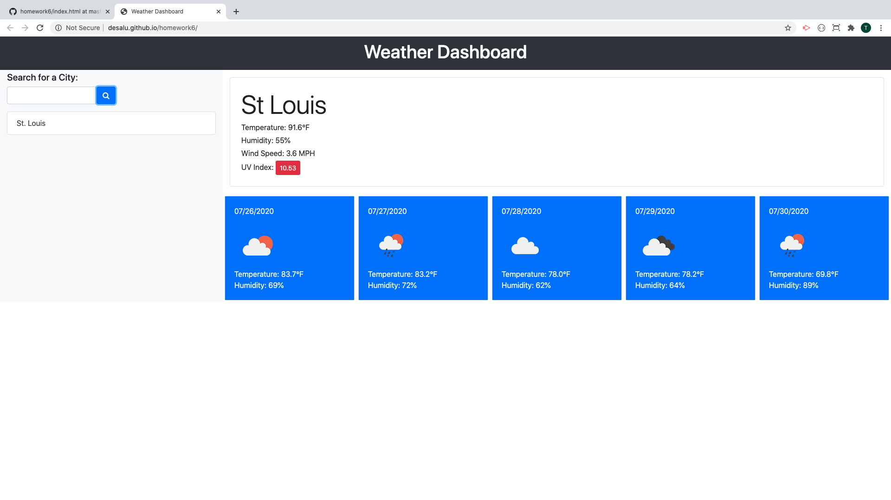
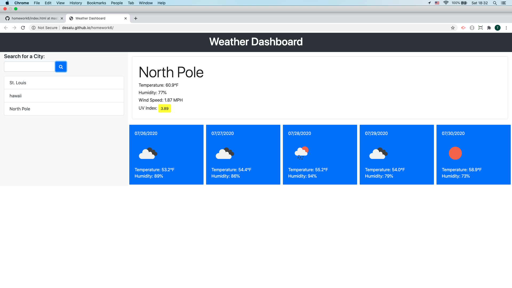

#            Homework6

 Weather Dashboard

**Purpose:** build a weather dashboard that will run in the browser and feature dynamically updated HTML and CSS.

**Tools:**
* HTML
* JS
* Jquery
* Bootstrap

**Deployment:**

[Weather Dashboard](https://desalu.github.io/homework6/)

**Images**

